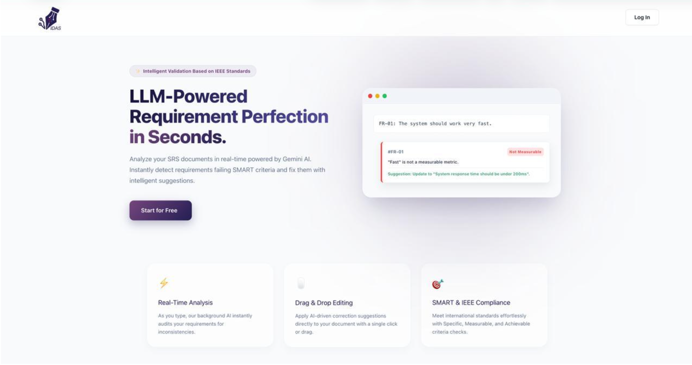
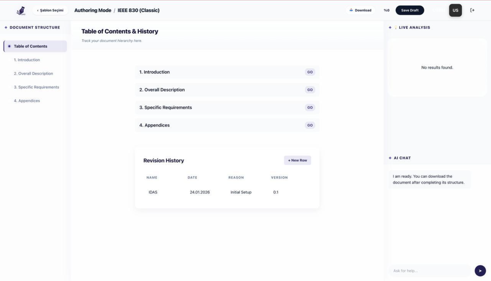
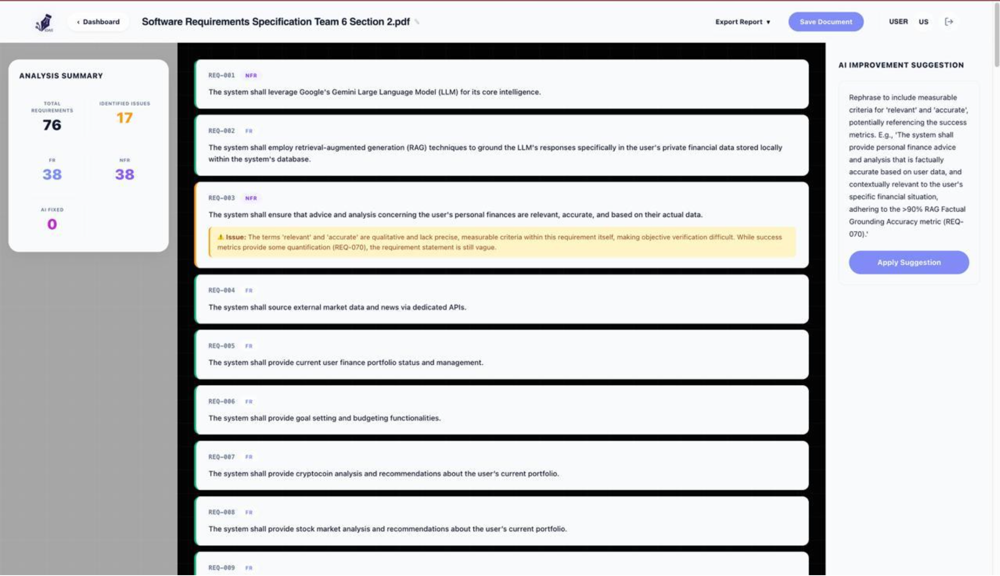

# IDAS — Intelligent Documentation Assistant

*A capstone collaboration with HAVELSAN SUIT at TED University*

IDAS is an intelligent documentation assistant that improves the quality of Software Requirements Specification (SRS) documents. It was built in collaboration with HAVELSAN SUIT, following HAVELSAN's internal documentation standards.

> 🔒 **Note:** This repository is not publicly runnable. As a HAVELSAN-affiliated capstone project, the data, standards documents, and configuration it depends on are confidential and not included here. The code below is shared to showcase the architecture and implementation approach.

## ✨ Features

- **Real-time terminology consistency checks** across SRS documents
- **Missing-section detection** against HAVELSAN documentation standards
- **AI-driven draft requirement generation** following HAVELSAN's required structure
- **Automated requirement extraction** from `.docx` files
- **Requirement classification** and quality analysis — flags ambiguity, untestability, and conflicting requirements

## 📸 Screenshots

**Landing page**


**Authoring Mode** — structuring an SRS document against a standard template (IEEE 830)


**Review Mode** — real-time AI analysis flagging an unmeasurable requirement and suggesting a fix


## 🏗️ Architecture

```
idas-project/
├── backend/       # API and AI/RAG pipeline (Python)
├── frontend/       # Web interface (JavaScript)
├── idas_data/       # Data handling
└── start.sh           # Local startup script
```

## 🛠️ Tech Stack

Python (RAG pipeline, requirement extraction/classification) · JavaScript & CSS (frontend) · RAG (Retrieval-Augmented Generation)

## 📅 Timeline

Sep. 2025 – May 2026, as part of the [HAVELSAN SUIT software engineering project](#) at TED University.
